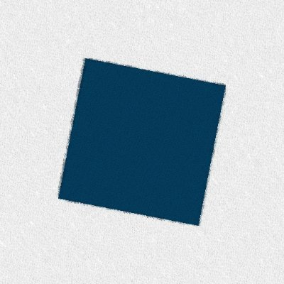
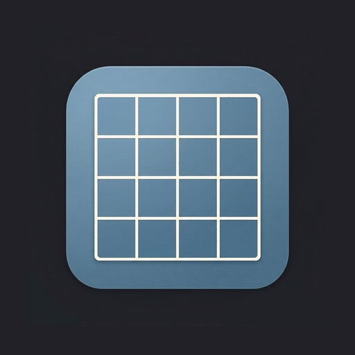
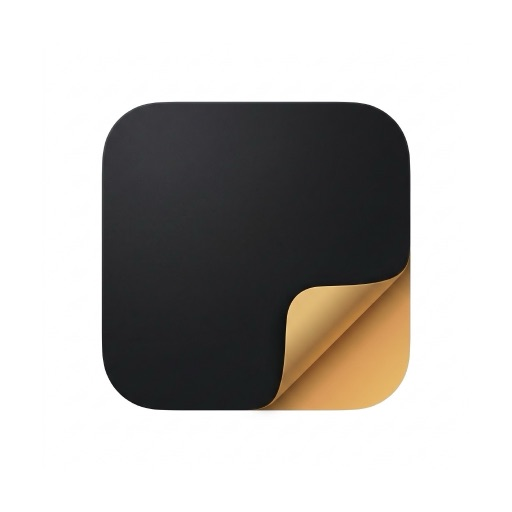
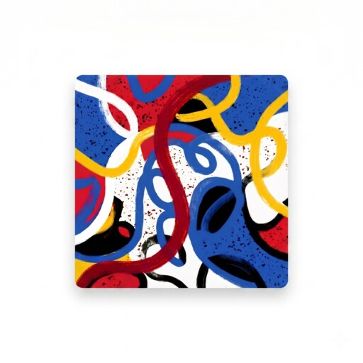
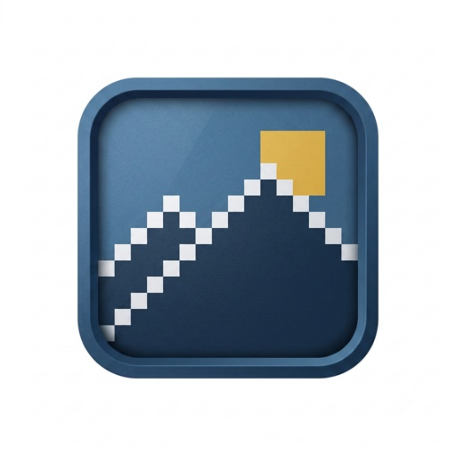
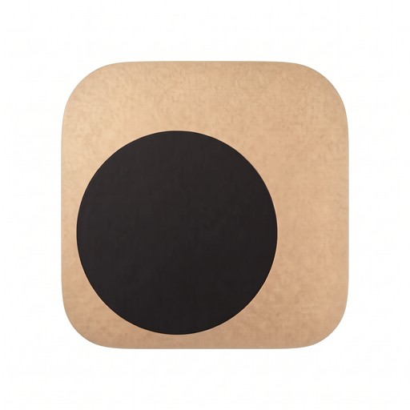
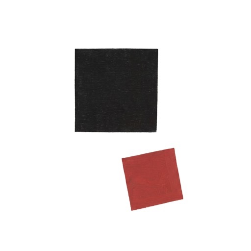
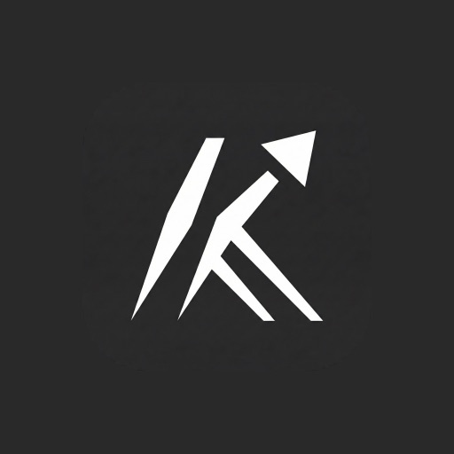

  

  # Paintingstack
  ### Enjoy the craft.

Paintingstack is a software studio in Chile. We design and build our own apps for iPhone, iPad, Mac, and Android.

<table>
<tr>
<td width="140" align="center">
   
  <a href="https://paintingstack.com/overgrid"><b>Overgrid</b></a>
</td>
<td>

The grid method, digital. A grid over any reference photo so the proportions land on canvas, panel, or paper, with custom colors, diagonals, and value studies, exported up to 4096px.

</td>
</tr>
<tr>
<td width="140" align="center">
   
  <a href="https://paintingstack.com/undertone"><b>Undertone</b></a>
</td>
<td>

Photograph anything and see the structure underneath: the palette with proportions, color harmony, warm and cool temperature, value. Nothing leaves the device.

</td>
</tr>
<tr>
<td width="140" align="center">
   
  <a href="https://paintingstack.com/trazu"><b>Trazu</b></a>
</td>
<td>

Painting with paint physics. Brushes load, deplete, and mix wet color on the canvas, across nine mediums and twelve papers.

</td>
</tr>
<tr>
<td width="140" align="center">
   
  <a href="https://paintingstack.com/koadro"><b>Koadro</b></a>
</td>
<td>

Any image into pixel art in a palette you pick, by honest downscaling instead of a redraw, so what comes out is what went in.

</td>
</tr>
<tr>
<td width="140" align="center">
   
  <a href="https://paintingstack.com/skisa"><b>Skisa</b></a>
</td>
<td>

Any photo into a line drawing, drawn stroke by stroke with an instrument you choose, fineliner through charcoal to silverpoint, instead of run through a filter.

</td>
</tr>
<tr>
<td width="140" align="center">
   
  <a href="https://paintingstack.com/mintza"><b>Mintza</b></a>
</td>
<td>

Speak a new language out loud with a bilingual AI teacher that talks back like a person and switches to your own language when you get stuck. Fifteen languages.

</td>
</tr>
<tr>
<td width="140" align="center">
   
  <a href="https://paintingstack.com/kountrain"><b>Kountrain</b></a>
</td>
<td>

Bodyweight training tracked rep by rep: push-ups, squats, planks, pull-ups, lunges, burpees. No account, works offline.

</td>
</tr>
</table>

[paintingstack.com](https://paintingstack.com) · [Blog](https://paintingstack.com/blog)

